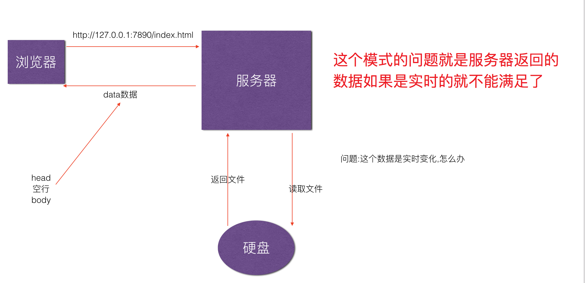
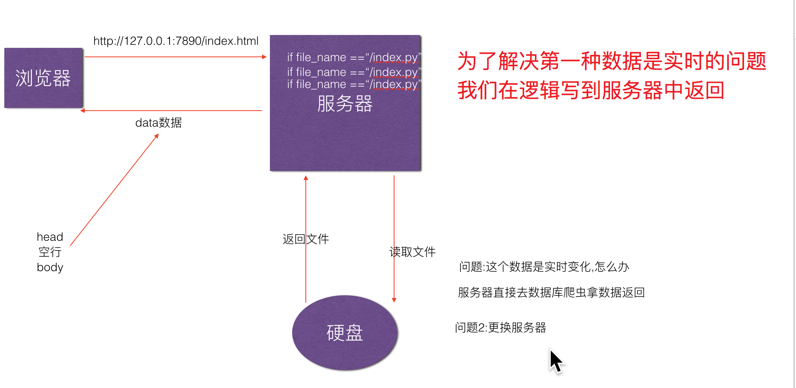
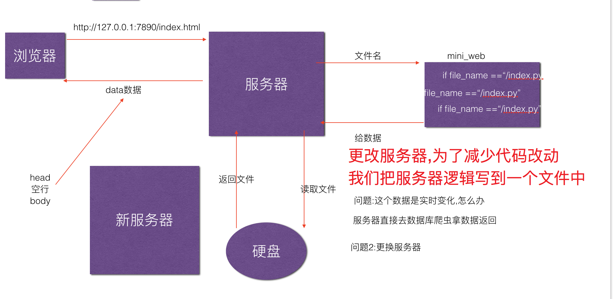
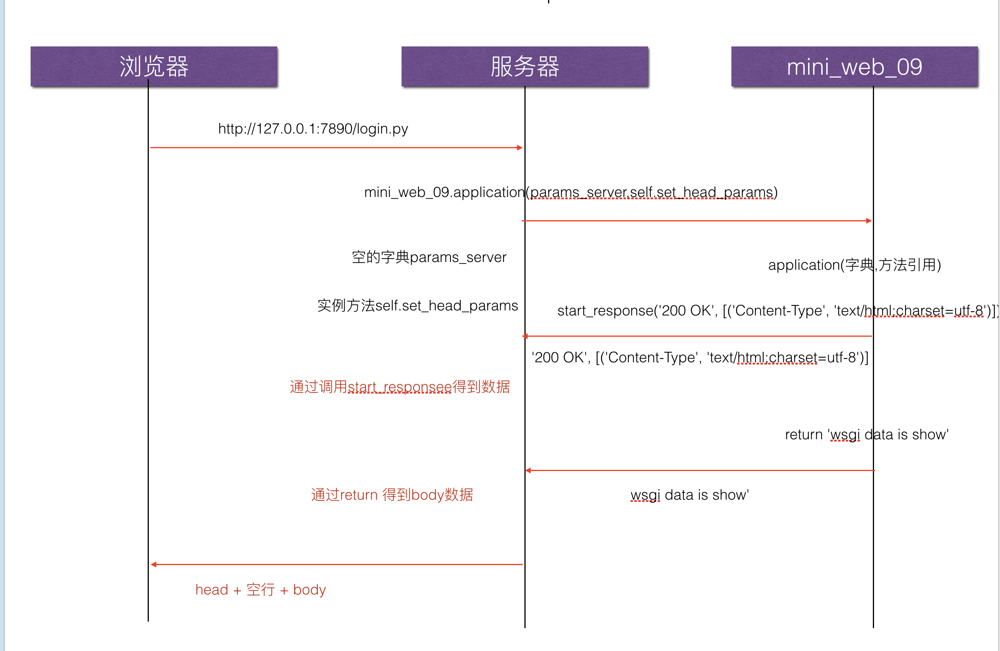

# WSGI协议
 - 是一种可以让不同的WEB服务器可以直接无缝的和不同的框架进行连接的约定
 
## wsgi协议推导图流程
### 使用最简单的http服务器流程

### 服务器处理逻辑代码

### 把服务器逻辑写到一个单独文件中

### wsgi协议最终流程图

### wsgi协议执行流程图

## 使用的案例为一个简单的Qtopia服务器
服务器程序

> qtopia_web_server.py

遵循WSGI的miniWEB框架

> mini_web.py